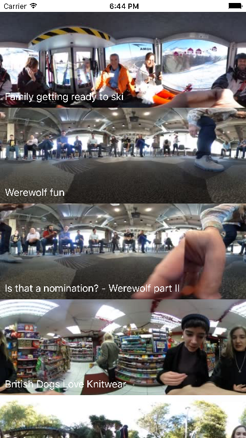
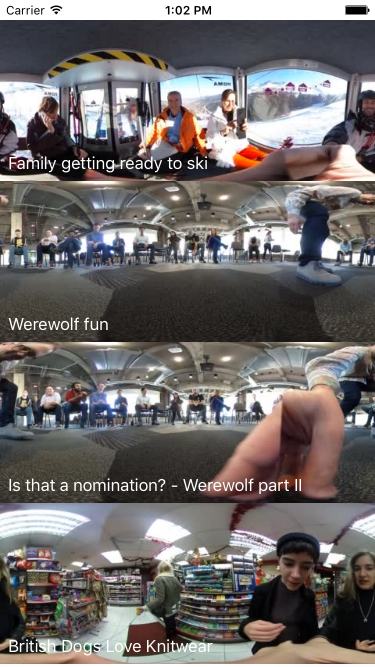

# MettaVR-Coding-Exercise
MettaVR Coding Exercise

Step 1. Create your own app that plays 360 videos.

This should be a very basic app (Android or iOS) that displays and plays 360 videos. A bonus for an intuitive UX and clean design. 

Materials
Json data of videos from Ceci, Jacob and me (Metta’s co-founders) http://www.mettavr.com/api/codingChallengeData (ts stands for timestamp, and other fields should be self explanatory)
Open source 360 video players:
 * a iOS 360 player: https://github.com/hanton/HTY360Player
 * an Android 360 player: https://github.com/fbsamples/360-video-player-for-android
Feel free to use any other players you find

Step 2. Make a small modification to the open source 360 player that you chose for task #1. 

Ideas include: 
A button to reset the orientation (Facebook’s 360 video player has one of these - check it out)
A deep link that, if opened in the app, would start the video at a predefined orientation / time
Color filters
Stickers that stay at a location relative to the video
Surprise us

Step 3. Send what you built to [REDACTED]@mettavr.com and we’ll arrange a 30 minute phone call for you to talk through what you learned and how you made decisions with Guillaume Sabran (CTO)

Timing and logistics
Please don’t spend more than 4 hours on the project and see how far you get in that time-frame.

The aim of this project is to understand more about how you work and what your strengths are - don’t feel under pressure to complete all steps of the process. The most important thing is that you get to show off what you’re best at: if you’re great at UX, spend longer on that; if you’re great at working fast and dirty, show us. Play to your strengths.

Please don’t hesitate to contact [REDACTED] via [REDACTED]@mettavr.com if you have any questions. 

You have up to 7 days to send back the completed challenge. If you have any pre-existing commitments which means you can’t turn around the challenge within 7 days just ping us an email to let us know when you can get it to us.

